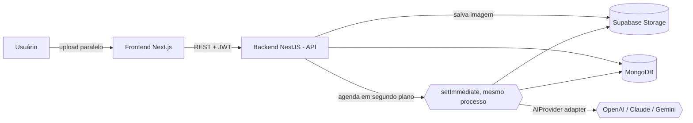
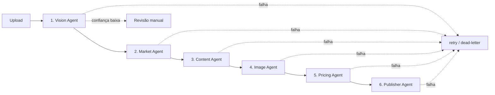

# Tecno Plus AI Catalog

Plataforma inteligente de **cadastro automático de produtos com IA** e
**integração com marketplaces**. O operador fotografa centenas de produtos no
Brás, faz upload, e uma cadeia de **agentes de IA** identifica cada produto,
pesquisa preços de mercado, gera o anúncio, trata as imagens, precifica e
publica — via API — direto na loja Shopee conectada, reduzindo o tempo de
cadastro em mais de 95%.

---

## Sumário

- [Arquitetura](#arquitetura)
- [Fluxo dos agentes](#fluxo-dos-agentes)
- [Integrações](#integrações)
- [Stack](#stack)
- [Pré-requisitos](#pré-requisitos)
- [Instalação e execução](#instalação-e-execução)
- [Estrutura do projeto](#estrutura-do-projeto)
- [API](#api)
- [Decisões técnicas](#decisões-técnicas)
- [Testes e qualidade](#testes-e-qualidade)
- [Documentação adicional](#documentação-adicional)

---

## Arquitetura

Monorepo com dois apps (frontend/backend) + um pacote de contratos
compartilhados (`shared`). O backend é **modular**: cada agente é um provider
isolado, orquestrado por um pipeline sequencial que roda em segundo plano
**no próprio processo da API** (sem Redis/worker separado) — a API nunca
bloqueia aguardando IA, mas o estado de progresso vive no MongoDB.



Ver os diagramas completos em [docs/ARCHITECTURE.md](docs/ARCHITECTURE.md) e a
documentação técnica detalhada em
[docs/ESTRUTURA_TECNICA.md](docs/ESTRUTURA_TECNICA.md).

## Fluxo dos agentes



| #   | Agente        | Responsabilidade                                                                                                                      |
| --- | ------------- | ------------------------------------------------------------------------------------------------------------------------------------- |
| 1   | **Vision**    | Lê a foto (IA Vision), extrai atributos, detecta múltiplos produtos, calcula confiança                                                |
| 2   | **Market**    | Consulta fontes de mercado (adapters), agrega preços, deriva índice de concorrência                                                   |
| 3   | **Content**   | Gera título, descrições, bullets, SEO, specs e descrição p/ marketplace                                                               |
| 4   | **Image**     | HD, quadrada (fundo branco), WebP, thumbnail (via `sharp`); ponto de extensão p/ remoção de fundo                                     |
| 5   | **Pricing**   | Markup por faixa + preço psicológico (,90), lucro, margem, ROI                                                                        |
| 6   | **Publisher** | Publica na loja (WebsitePublisher) ou direto na Shopee via API (ShopeePublisher). Mercado Livre/Amazon = interfaces prontas p/ plugar |

## Integrações

Tela dedicada em **Integrações** (`/integrations`), com conexões reais e
funcionais — não apenas planejadas:

| Canal                    | Tipo                                       | O que faz                                                                                                                                                                                                                                                                                                                                                    |
| ------------------------ | ------------------------------------------ | ------------------------------------------------------------------------------------------------------------------------------------------------------------------------------------------------------------------------------------------------------------------------------------------------------------------------------------------------------------ |
| **Shopee**               | API oficial (Shopee Open Platform, OAuth2) | Conecta a loja do lojista (`shop/auth_partner`), publica/atualiza produtos (`product.add_item`/`update_item`, com upload de imagens ao Media Space e consulta de canais logísticos ao vivo), lê pedidos reais (`order.get_order_list`) e testa a conexão (`shop.get_shop_info`) — ver `apps/backend/src/modules/integrations/`.                              |
| **Mercado Livre**        | API oficial (OAuth2 + PKCE)                | Conecta a conta do vendedor (`/authorization` com `code_challenge`/PKCE), publica/atualiza/pausa anúncios (`POST`/`PUT /items`, descrição via `/items/:id/description`) e testa a conexão (`/users/me`) — ver `apps/backend/src/modules/integrations/`. Webhook de pedidos e sync de estoque/preço ainda não implementados (ver [Roadmap](docs/ROADMAP.md)). |
| **Loja online**          | Interna                                    | Publica no catálogo próprio servido pelo frontend.                                                                                                                                                                                                                                                                                                           |
| **Facebook / Instagram** | API oficial (Graph API)                    | Postagem diária automática com aprovação via Telegram.                                                                                                                                                                                                                                                                                                       |
| Amazon                   | Em desenvolvimento                         | Interface `MarketplacePublisher` pronta; falta plugar a API oficial (ver [Roadmap](docs/ROADMAP.md)).                                                                                                                                                                                                                                                        |

A exportação em planilha (`GET /products/export/shopee`, Importação em Massa
do Seller Center) continua existindo como caminho alternativo/offline — mas a
integração via API é o caminho principal para lojas que já autorizaram o app.

## Stack

**Frontend:** Next.js 15 · React 19 · TypeScript · TailwindCSS · Framer Motion ·
React Query · next-themes (dark/light) · visual inspirado no iOS com
glassmorphism pontual.

**Backend:** NestJS · TypeScript · Mongoose (MongoDB) · pipeline em segundo
plano no próprio processo (sem Redis/worker) · Passport JWT · Swagger ·
Helmet · Throttler · `sharp` · Supabase Storage.

**IA:** camada `AIProvider` (adapter) com implementações OpenAI, Claude e Gemini —
troca por variável de ambiente, sem acoplar nenhum agente a um SDK específico.

## Pré-requisitos

- Node.js ≥ 20
- Docker + Docker Compose (para o MongoDB local)
- Chave de ao menos um provedor de IA (opcional para subir; obrigatória p/ o
  pipeline gerar resultados reais)

## Instalação e execução

```bash
# 1. Variáveis de ambiente
cp .env.example .env        # edite as chaves de IA / Supabase se tiver

# 2. Dependências (monorepo)
npm install

# 3. Infra local (MongoDB)
npm run infra:up

# 4. Build do pacote compartilhado (uma vez)
npm run build:shared

# 5. Suba API + Frontend
npm run dev
#   API .......... http://localhost:3333/api
#   Swagger ...... http://localhost:3333/api/docs
#   Frontend ..... http://localhost:3000

# 6. (Opcional) bot do Telegram, em outro terminal
npm run bot:dev --workspace @tecnoplus/backend
```

O pipeline de IA roda dentro do próprio processo da API (sem worker
separado) — o passo 5 já é suficiente para o cadastro automático funcionar.

> **Tudo em containers?** `docker compose --profile apps up --build` sobe a
> infra e os apps juntos (API com bot embutido e Frontend).

Primeiro acesso: abra o frontend, clique em **Cadastre-se**, crie um usuário e
comece pelo **Upload**.

## Estrutura do projeto

```
.
├── apps/
│   ├── backend/          # NestJS: API + pipeline de IA + bot Telegram
│   │   └── src/
│   │       ├── agents/           # os 7 agentes + publishers + fontes de mercado
│   │       ├── modules/
│   │       │   ├── ai/            # AIProvider + OpenAI/Claude/Gemini, roteados por capacidade
│   │       │   ├── auth/          # JWT (register/login/refresh)
│   │       │   ├── database/      # schemas Mongo
│   │       │   ├── products/      # CRUD + exportação Shopee (shopee/)
│   │       │   ├── integrations/  # Shopee Open Platform API (OAuth, produto, pedido)
│   │       │   ├── uploads/       # ingestão (web/Telegram) + deduplicação
│   │       │   ├── queues/        # execução em processo (sem Redis) + orquestrador do pipeline
│   │       │   ├── storage/       # Supabase Storage
│   │       │   ├── publish/       # publicação
│   │       │   ├── telegram/      # bot (long-polling)
│   │       │   ├── ops/           # dashboard, jobs, logs
│   │       │   └── health/
│   │       ├── main.ts            # entrypoint API (o pipeline roda dentro dela)
│   │       └── telegram.ts        # entrypoint do bot (processo próprio)
│   └── frontend/         # Next.js 15 (App Router)
├── shared/               # @tecnoplus/shared — tipos, interfaces, utils puros
├── docs/                 # ESTRUTURA_TECNICA.md, ARCHITECTURE.md, DEPLOY.md, ROADMAP.md
└── docker-compose.yml
```

## API

REST versionada sob `/api`, documentada em **Swagger** (`/api/docs`).

| Método         | Rota                                           | Descrição                                                           |
| -------------- | ---------------------------------------------- | ------------------------------------------------------------------- |
| POST           | `/auth/register` `/auth/login` `/auth/refresh` | Autenticação JWT                                                    |
| POST           | `/upload`                                      | Upload de N imagens (multipart) → cria produtos + enfileira         |
| GET            | `/products`                                    | Lista com busca, filtro, paginação, ordenação                       |
| GET/PUT/DELETE | `/products/:id`                                | Detalhe / editar / excluir                                          |
| POST           | `/products/:id/duplicate`                      | Duplicar                                                            |
| POST           | `/products/:id/publish` · `/republish`         | Publicar (`?channel=shopee` para publicar via API na Shopee)        |
| GET            | `/dashboard`                                   | Indicadores + filas                                                 |
| GET            | `/jobs`                                        | Estado das filas                                                    |
| GET            | `/logs`                                        | Logs de execução dos agentes                                        |
| GET            | `/health`                                      | Saúde (Mongo, provedor de IA)                                       |
| GET            | `/integrations`                                | Status de cada canal (conectado/configurado)                        |
| GET            | `/integrations/shopee/connect`                 | URL de autorização OAuth da Shopee                                  |
| GET            | `/integrations/shopee/callback`                | Redirect da Shopee após autorização (troca `code` por token)        |
| POST           | `/integrations/shopee/disconnect`              | Desconecta a loja                                                   |
| GET            | `/integrations/shopee/test`                    | Chama `shop.get_shop_info` — prova a conexão ao vivo                |
| GET            | `/integrations/shopee/orders`                  | Pedidos reais recentes da loja conectada                            |
| GET            | `/integrations/mercado-livre/connect`          | URL de autorização OAuth2+PKCE do Mercado Livre                     |
| GET            | `/integrations/mercado-livre/callback`         | Redirect do Mercado Livre após autorização (troca `code` por token) |
| POST           | `/integrations/mercado-livre/disconnect`       | Desconecta a conta                                                  |
| GET            | `/integrations/mercado-livre/test`             | Chama `/users/me` — prova a conexão ao vivo                         |

## Decisões técnicas

Resumo (detalhes em [docs/ARCHITECTURE.md](docs/ARCHITECTURE.md)):

- **Adapter de IA** — nenhum agente conhece a OpenAI; todos dependem da
  interface `AIProvider`. Trocar de modelo é mudar `AI_PROVIDER` no `.env`.
- **API não bloqueia** — upload salva no storage e agenda o pipeline em
  segundo plano no próprio processo (`setImmediate` + estado no MongoDB, sem
  Redis/worker separado). Cumpre "nunca bloquear a interface aguardando IA".
- **Pacote `shared` sem dependências** — só tipos e funções puras (ex.:
  precificação), reutilizáveis por back e front, e testáveis isoladamente.
- **Publishers/MarketSources como coleções injetáveis** — adicionar um canal ou
  fonte é registrar uma classe; o restante não muda. É assim que o
  `ShopeePublisher` real substitui o stub sem tocar no `PublisherAgent`.
- **Bot do Telegram isolado do HTTP** reaproveitando o mesmo `AppModule` —
  mesma configuração/DI, dois entrypoints (`main.ts` e `telegram.ts`).
- **OAuth Shopee/Mercado Livre sem estado em memória** — o `state` do redirect
  fica no Mongo com TTL curto (`shopee_oauth_states`/`mercado_livre_oauth_states`),
  não em sessão/JWT — funciona mesmo com múltiplas instâncias do backend atrás
  de um load balancer. O Mercado Livre usa Authorization Code + PKCE (S256):
  o `code_verifier` viaja junto do `state`, nunca no navegador.
- **Tokens criptografados em repouso** — `access_token`/`refresh_token` de
  Shopee e Mercado Livre são cifrados (AES-256-GCM) antes de ir ao Mongo, via
  `TOKEN_ENCRYPTION_KEY` (`modules/integrations/token-crypto.util.ts`).

## Testes e qualidade

```bash
npm run test           # testes unitários (backend)
npm run lint           # ESLint em todo o monorepo
npm run format         # Prettier
```

ESLint + Prettier + Husky (pre-commit com lint-staged) configurados.

## Documentação adicional

- [docs/ESTRUTURA_TECNICA.md](docs/ESTRUTURA_TECNICA.md) — stack completo, linguagens e estrutura módulo a módulo
- [docs/ARCHITECTURE.md](docs/ARCHITECTURE.md) — diagramas e justificativas
- [docs/ROADMAP.md](docs/ROADMAP.md) — evolução até produção e melhorias priorizadas
- [docs/DEPLOY.md](docs/DEPLOY.md) — deploy grátis no Render + configuração da Shopee Open Platform
- [docs/SHOPEE_OPEN_PLATFORM.md](docs/SHOPEE_OPEN_PLATFORM.md) — checklist de submissão como Third-party Partner
