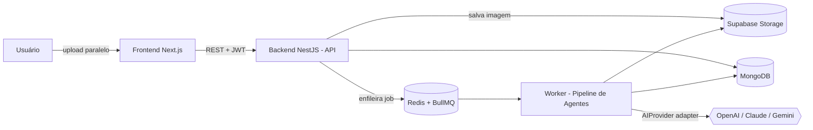
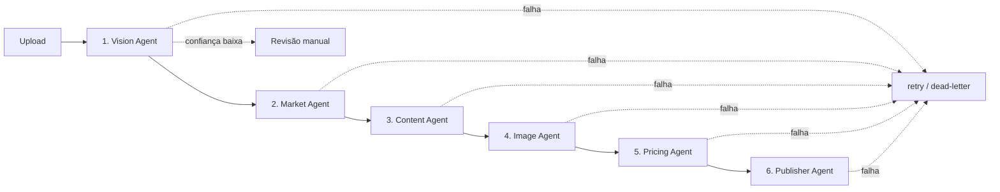

# Tecno Plus AI Catalog

Plataforma inteligente de **cadastro automático de produtos com IA**. O operador
fotografa centenas de produtos no Brás, faz upload, e uma cadeia de **agentes de
IA** identifica cada produto, pesquisa preços de mercado, gera o anúncio, trata
as imagens, precifica e publica na loja — reduzindo o tempo de cadastro em mais
de 95%.

> **Status:** MVP — Fase 1 (fundação arquitetural + pipeline ponta-a-ponta
> funcional). Ver [Roadmap](docs/ROADMAP.md) para o caminho até produção.

---

## Sumário

- [Arquitetura](#arquitetura)
- [Fluxo dos agentes](#fluxo-dos-agentes)
- [Stack](#stack)
- [Pré-requisitos](#pré-requisitos)
- [Instalação e execução](#instalação-e-execução)
- [Estrutura do projeto](#estrutura-do-projeto)
- [API](#api)
- [Decisões técnicas](#decisões-técnicas)
- [Testes e qualidade](#testes-e-qualidade)
- [Documentação adicional](#documentação-adicional)

---

## Arquitetura

Monorepo com dois apps (frontend/backend) + um pacote de contratos
compartilhados (`shared`). O backend é **modular** e preparado para extração em
microsserviços: cada agente é um provider isolado, orquestrado por **filas**, e
o processamento pesado roda em um **worker separado** — a API nunca bloqueia
aguardando IA.



Ver os diagramas completos em [docs/ARCHITECTURE.md](docs/ARCHITECTURE.md).

## Fluxo dos agentes



| #   | Agente        | Responsabilidade                                                                                  |
| --- | ------------- | ------------------------------------------------------------------------------------------------- |
| 1   | **Vision**    | Lê a foto (IA Vision), extrai atributos, detecta múltiplos produtos, calcula confiança            |
| 2   | **Market**    | Consulta fontes de mercado (adapters), agrega preços, deriva índice de concorrência               |
| 3   | **Content**   | Gera título, descrições, bullets, SEO, specs e descrição p/ marketplace                           |
| 4   | **Image**     | HD, quadrada (fundo branco), WebP, thumbnail (via `sharp`); ponto de extensão p/ remoção de fundo |
| 5   | **Pricing**   | Markup por faixa + preço psicológico (,90), lucro, margem, ROI                                    |
| 6   | **Publisher** | Publica na loja (WebsitePublisher). Shopee/ML/Amazon = interfaces prontas p/ plugar               |

## Stack

**Frontend:** Next.js 15 · React 19 · TypeScript · TailwindCSS · Framer Motion ·
React Query · next-themes (dark/light) · visual inspirado no iOS com
glassmorphism pontual.

**Backend:** NestJS · TypeScript · Mongoose (MongoDB) · BullMQ (Redis) ·
Passport JWT · Swagger · Helmet · Throttler · `sharp` · Supabase Storage.

**IA:** camada `AIProvider` (adapter) com implementações OpenAI, Claude e Gemini —
troca por variável de ambiente, sem acoplar nenhum agente a um SDK específico.

## Pré-requisitos

- Node.js ≥ 20
- Docker + Docker Compose (para MongoDB e Redis)
- Chave de ao menos um provedor de IA (opcional para subir; obrigatória p/ o
  pipeline gerar resultados reais)

## Instalação e execução

```bash
# 1. Variáveis de ambiente
cp .env.example .env        # edite as chaves de IA / Supabase se tiver

# 2. Dependências (monorepo)
npm install

# 3. Infra local (MongoDB + Redis)
npm run infra:up

# 4. Build do pacote compartilhado (uma vez)
npm run build:shared

# 5. Suba API + Frontend
npm run dev
#   API .......... http://localhost:3333/api
#   Swagger ...... http://localhost:3333/api/docs
#   Frontend ..... http://localhost:3000

# 6. Em outro terminal: o WORKER que processa o pipeline
npm run worker:dev --workspace @tecnoplus/backend
```

> **Tudo em containers?** `docker compose --profile apps up --build` sobe
> Mongo, Redis, API+worker e Frontend juntos.

Primeiro acesso: abra o frontend, clique em **Cadastre-se**, crie um usuário e
comece pelo **Upload**.

## Estrutura do projeto

```
.
├── apps/
│   ├── backend/          # NestJS: API (main.ts) + worker (worker.ts)
│   │   └── src/
│   │       ├── agents/           # os 6 agentes + publishers + fontes de mercado
│   │       ├── modules/
│   │       │   ├── ai/            # AIProvider + OpenAI/Claude/Gemini + factory
│   │       │   ├── auth/          # JWT (register/login/refresh)
│   │       │   ├── database/      # schemas Mongo
│   │       │   ├── products/      # CRUD
│   │       │   ├── uploads/       # ingestão + enqueue
│   │       │   ├── queues/        # BullMQ + orquestrador do pipeline
│   │       │   ├── storage/       # Supabase Storage
│   │       │   ├── publish/       # publicação
│   │       │   ├── ops/           # dashboard, jobs, logs
│   │       │   └── health/
│   │       ├── main.ts            # entrypoint API
│   │       └── worker.ts          # entrypoint worker (background)
│   └── frontend/         # Next.js 15 (App Router)
├── shared/               # @tecnoplus/shared — tipos, interfaces, utils puros
├── docs/                 # ARCHITECTURE.md, ROADMAP.md
└── docker-compose.yml
```

## API

REST versionada sob `/api`, documentada em **Swagger** (`/api/docs`).

| Método         | Rota                                           | Descrição                                                   |
| -------------- | ---------------------------------------------- | ----------------------------------------------------------- |
| POST           | `/auth/register` `/auth/login` `/auth/refresh` | Autenticação JWT                                            |
| POST           | `/upload`                                      | Upload de N imagens (multipart) → cria produtos + enfileira |
| GET            | `/products`                                    | Lista com busca, filtro, paginação, ordenação               |
| GET/PUT/DELETE | `/products/:id`                                | Detalhe / editar / excluir                                  |
| POST           | `/products/:id/duplicate`                      | Duplicar                                                    |
| POST           | `/products/:id/publish` · `/republish`         | Publicar                                                    |
| GET            | `/dashboard`                                   | Indicadores + filas                                         |
| GET            | `/jobs`                                        | Estado das filas                                            |
| GET            | `/logs`                                        | Logs de execução dos agentes                                |
| GET            | `/health`                                      | Saúde (Mongo, provedor de IA)                               |

## Decisões técnicas

Resumo (detalhes em [docs/ARCHITECTURE.md](docs/ARCHITECTURE.md)):

- **Adapter de IA** — nenhum agente conhece a OpenAI; todos dependem da
  interface `AIProvider`. Trocar de modelo é mudar `AI_PROVIDER` no `.env`.
- **API não processa** — upload só salva no storage e enfileira; o worker roda o
  pipeline. Isso cumpre "nunca bloquear a interface aguardando IA".
- **Pacote `shared` sem dependências** — só tipos e funções puras (ex.:
  precificação), reutilizáveis por back e front, e testáveis isoladamente.
- **Publishers/MarketSources como coleções injetáveis** — adicionar um canal ou
  fonte é registrar uma classe; o restante não muda.
- **Worker isolado do HTTP** reaproveitando o mesmo `AppModule` — mesma
  configuração/DI, dois entrypoints.

## Testes e qualidade

```bash
npm run test           # testes unitários (backend)
npm run lint           # ESLint em todo o monorepo
npm run format         # Prettier
```

ESLint + Prettier + Husky (pre-commit com lint-staged) configurados.

## Documentação adicional

- [docs/ARCHITECTURE.md](docs/ARCHITECTURE.md) — diagramas e justificativas
- [docs/ROADMAP.md](docs/ROADMAP.md) — evolução até produção e melhorias priorizadas
