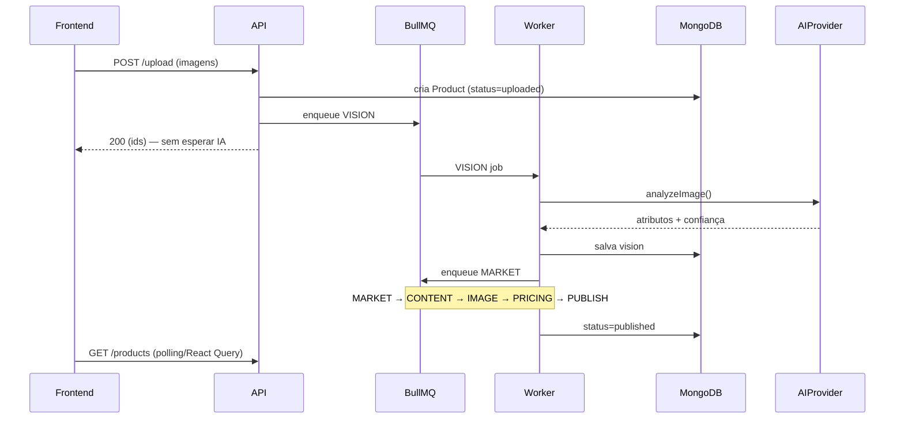
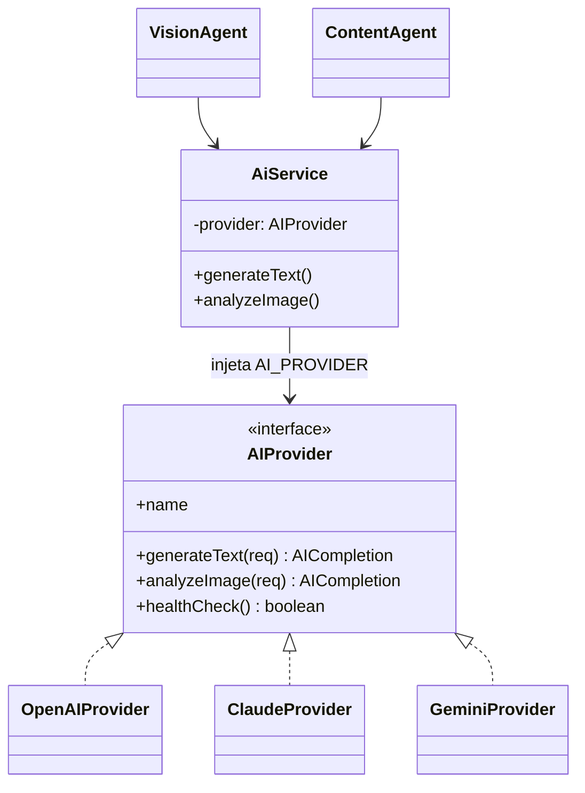
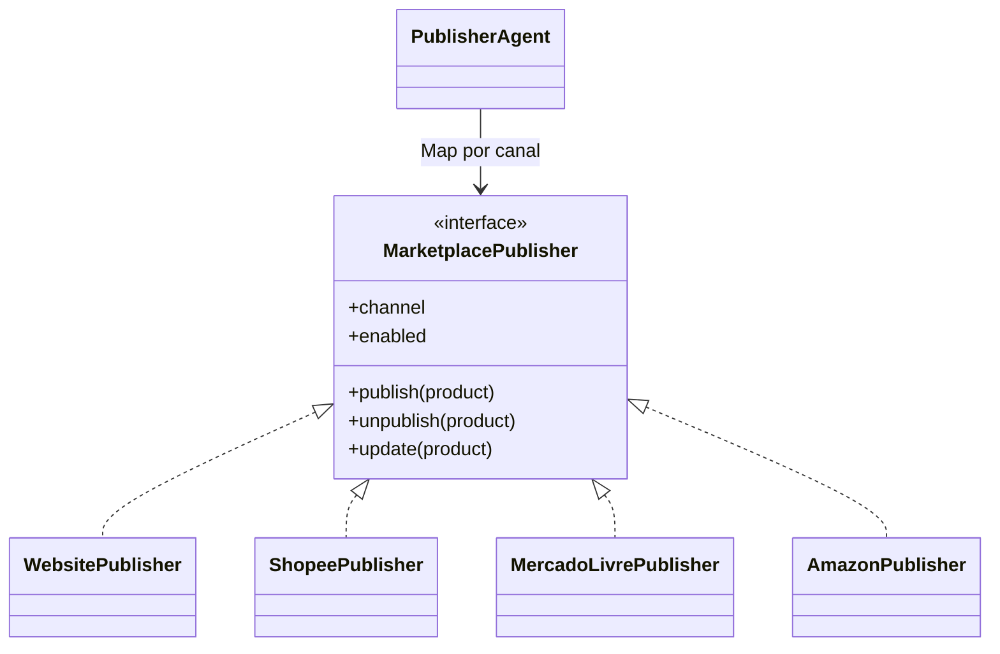
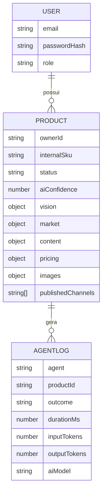

# Arquitetura — Tecno Plus AI Catalog

## Visão de componentes

```mermaid
flowchart TB
  subgraph Client
    FE[Next.js 15 App Router]
  end
  subgraph Edge
    API[NestJS API - main.ts]
  end
  subgraph Background
    W[Worker - worker.ts]
  end
  subgraph Infra
    DB[(MongoDB)]
    RQ[(Redis / BullMQ)]
    ST[(MongoDB GridFS)]
  end
  subgraph External
    AI{{AIProvider: OpenAI | Claude | Gemini}}
    MS[[Market Sources]]
    MP[[Marketplace Publishers]]
  end

  FE -->|JWT REST| API
  API --> DB
  API --> ST
  API -->|enqueue| RQ
  RQ -->|consume| W
  W --> DB
  W --> ST
  W --> AI
  W --> MS
  W --> MP
```

**Princípio central:** a API é fina — autentica, valida, persiste e enfileira.
Todo trabalho caro (visão, geração de conteúdo, tratamento de imagem) vive no
**worker**, consumindo filas. Assim a interface nunca bloqueia.

## Pipeline dos agentes (sequência)



## Camada de IA (Adapter)



O token `AI_PROVIDER` é resolvido em bootstrap (`ai.module.ts`) conforme
`AI_PROVIDER` do ambiente. Os agentes dependem de `AiService` / `AIProvider` —
**nunca** de um SDK. Trocar de modelo não toca em nenhum agente.

## Publicação multi-canal (Strategy)



No MVP só `WebsitePublisher` está habilitado. Os demais implementam a interface
e lançam `NotImplemented` — os pontos de extensão já existem.

## Modelo de dados (coleções)



Índices: texto em `vision.name / vision.brand / internalSku` (busca instantânea);
composto `ownerId + status + createdAt` (listagem/ordenação); `agent + createdAt`
em logs.

## Justificativas técnicas

1. **Monorepo com `shared` puro** — contratos e regras (ex.: precificação)
   ficam num pacote sem dependências, importado por back e front. Uma única
   fonte de verdade para tipos e cálculos, testável isoladamente.

2. **Filas por agente + encadeamento** — cada etapa é uma fila BullMQ própria.
   Isola falhas (um erro de imagem não derruba a visão), permite concorrência
   independente por etapa e dá retry/backoff/dead-letter de graça.

3. **API × Worker separados, mesmo AppModule** — reaproveita DI/config sem
   duplicar código. Em produção, escala horizontalmente o worker sem tocar na
   API.

4. **Adapters para tudo que é externo** (IA, fontes de mercado, publishers,
   storage) — a substituição por APIs oficiais no futuro é local e não altera a
   arquitetura, cumprindo o requisito de extensibilidade.

5. **Confiança da IA como gate** — abaixo do limiar, o produto vai para
   `needs_review` e o pipeline pausa, evitando publicar cadastros ruins.

6. **Segurança** — Helmet, CORS restrito, rate limit (Throttler), validação
   (class-validator) e JWT com refresh. Chaves de IA só no backend.
