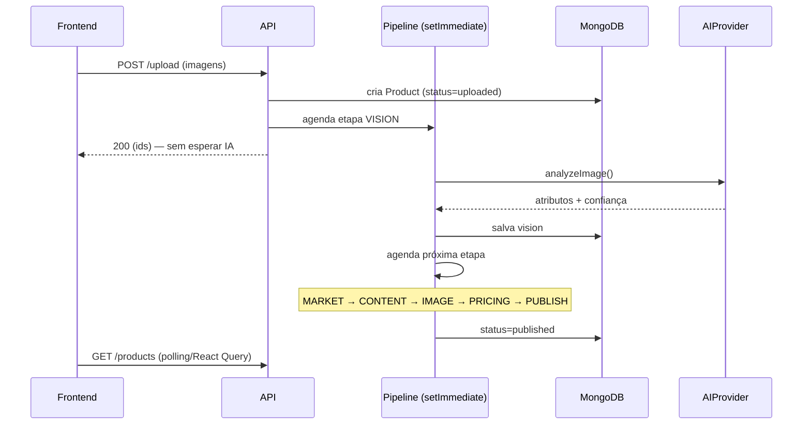
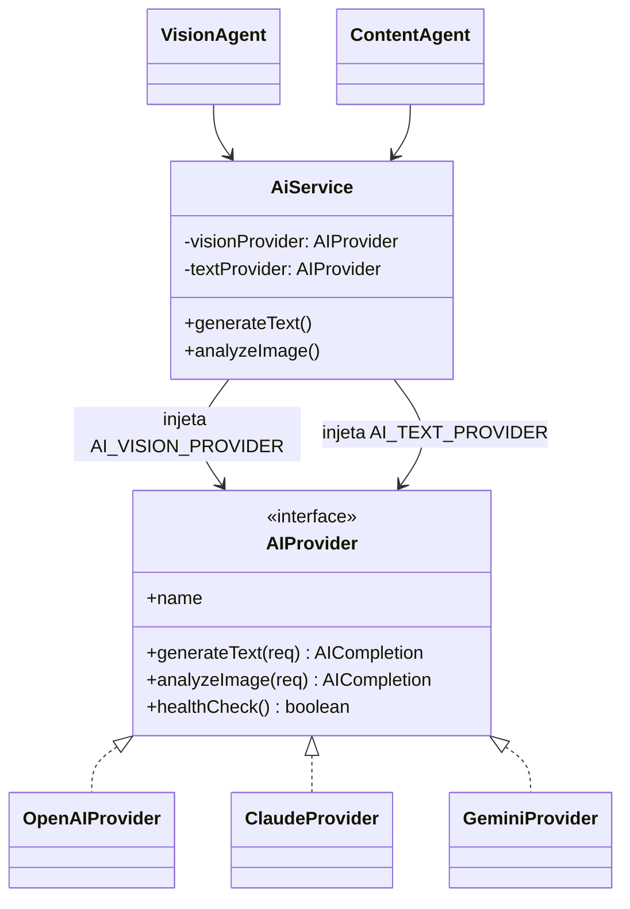
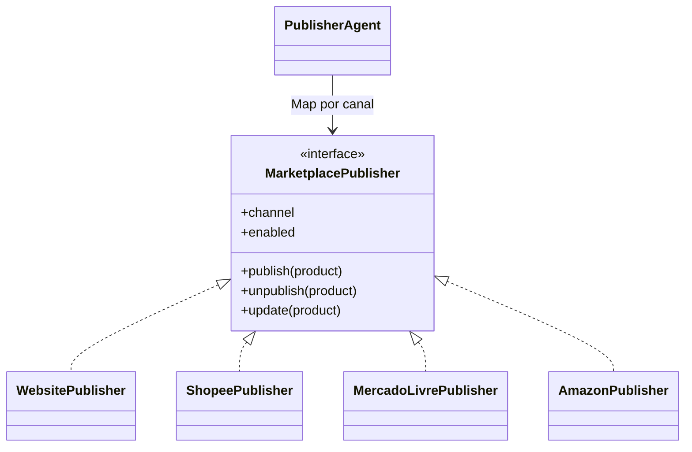
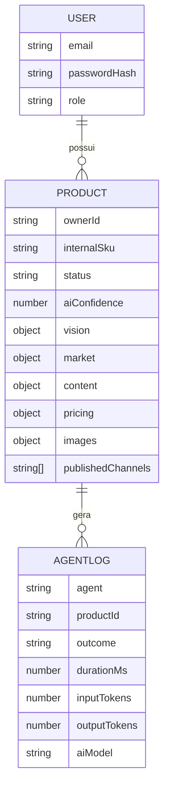

# Arquitetura — zycron

## Visão de componentes

```mermaid
flowchart TB
  subgraph Client
    FE[Next.js 15 App Router]
  end
  subgraph "Processo backend (main.ts)"
    API[NestJS API]
    BG{{Pipeline em segundo plano - setImmediate}}
  end
  subgraph "Processo bot (telegram.ts)"
    BOT[TelegramService - long-polling]
  end
  subgraph Infra
    DB[(MongoDB)]
    ST[(Supabase Storage)]
  end
  subgraph External
    AI{{AIProvider: OpenAI | Claude | Gemini}}
    MS[[Market Sources]]
    MP[[Marketplace Publishers]]
  end

  FE -->|JWT REST| API
  BOT -->|ingest de foto| API
  API --> DB
  API --> ST
  API -->|agenda| BG
  BG --> DB
  BG --> ST
  BG --> AI
  BG --> MS
  BG --> MP
```

**Princípio central:** a API é fina na resposta HTTP — autentica, valida,
persiste e agenda. Todo trabalho caro (visão, geração de conteúdo, tratamento
de imagem) roda **em segundo plano no mesmo processo** (sem Redis nem worker
dedicado — ver [docs/ESTRUTURA_TECNICA.md](ESTRUTURA_TECNICA.md#5-arquitetura-de-execução)
para o motivo da mudança), então a interface nunca bloqueia esperando a IA.

## Pipeline dos agentes (sequência)



## Camada de IA (Adapter)



O roteamento é **por capacidade**, não por um único provider global:
`AI_VISION_PROVIDER` (padrão Gemini) resolve imagens, `AI_TEXT_PROVIDER`
(padrão Claude) resolve texto — ambos configurados em `ai.module.ts` a partir
do `.env`. Os agentes dependem de `AiService` / `AIProvider` — **nunca** de um
SDK. Trocar de modelo não toca em nenhum agente.

## Publicação multi-canal (Strategy)



No MVP só `WebsitePublisher` está habilitado. Os demais implementam a interface
e lançam `NotImplemented` — os pontos de extensão já existem.

## Modelo de dados (coleções)



Índices: texto em `vision.name / vision.brand / internalSku` (busca instantânea);
composto `ownerId + status + createdAt` (listagem/ordenação); `agent + createdAt`
em logs.

## Justificativas técnicas

1. **Monorepo com `shared` puro** — contratos e regras (ex.: precificação)
   ficam num pacote sem dependências, importado por back e front. Uma única
   fonte de verdade para tipos e cálculos, testável isoladamente.

2. **Etapas encadeadas em segundo plano** — cada etapa do pipeline agenda a
   próxima (`QueueService.enqueue`) dentro do mesmo processo, via
   `setImmediate`, com o MongoDB guardando o estado (`status` do produto).
   Isola falhas por etapa (`withLog` marca `ERROR` sem derrubar o processo),
   mas **não há mais retry automático nem durabilidade de fila** — trade-off
   assumido depois que o desenho anterior (fila BullMQ sobre Redis) estourava
   a cota gratuita do provedor de Redis em produção. Se o processo reiniciar
   no meio, o operador reprocessa via `POST /products/:id/process`.

3. **Bot do Telegram × API, mesmo AppModule** — dois entrypoints (`main.ts`,
   `telegram.ts`) reaproveitando a mesma configuração/DI sem duplicar código;
   sobem juntos no mesmo container em produção.

4. **Adapters para tudo que é externo** (IA, fontes de mercado, publishers,
   storage) — a substituição por APIs oficiais no futuro é local e não altera a
   arquitetura, cumprindo o requisito de extensibilidade.

5. **Confiança da IA como gate** — abaixo do limiar, o produto vai para
   `needs_review` e o pipeline pausa, evitando publicar cadastros ruins.

6. **Segurança** — Helmet, CORS restrito, rate limit (Throttler), validação
   (class-validator) e JWT com refresh. Chaves de IA só no backend.
