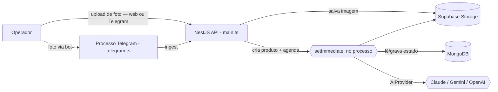
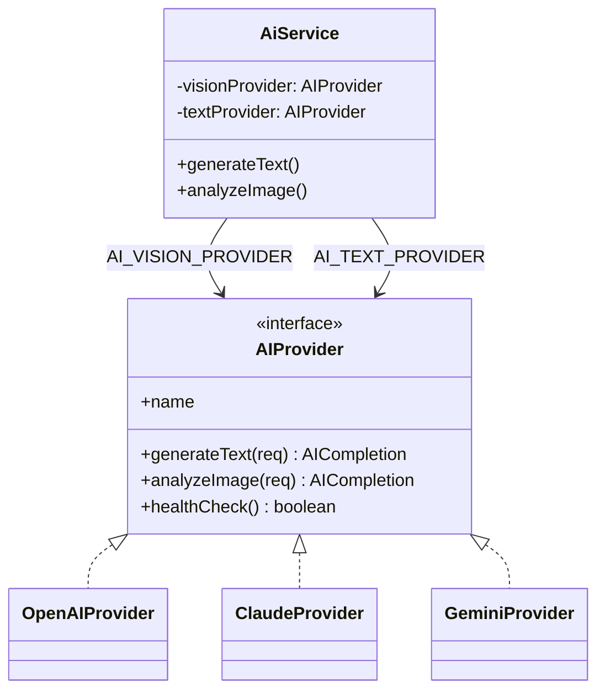
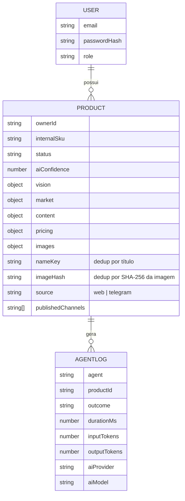

# Documentação Técnica — Tecno Plus AI Catalog

> Referência técnica de como o projeto está estruturado, quais linguagens e
> tecnologias compõem cada camada, e como as peças se conectam em runtime.
> Reflete o estado atual do código (não o histórico) — onde a documentação
> antiga (`README.md` / `ARCHITECTURE.md`) divergia da implementação, este
> documento descreve o que **realmente roda hoje**.

---

## Sumário

1. [Visão geral](#1-visão-geral)
2. [Stack tecnológico](#2-stack-tecnológico)
3. [Linguagens utilizadas](#3-linguagens-utilizadas)
4. [Topologia do monorepo](#4-topologia-do-monorepo)
5. [Arquitetura de execução](#5-arquitetura-de-execução)
6. [Backend — módulos e responsabilidades](#6-backend--módulos-e-responsabilidades)
7. [Pipeline de agentes de IA](#7-pipeline-de-agentes-de-ia)
8. [Camada de IA multi-provider](#8-camada-de-ia-multi-provider)
9. [Modelo de dados](#9-modelo-de-dados)
10. [Frontend](#10-frontend)
11. [Integrações externas](#11-integrações-externas)
12. [Segurança](#12-segurança)
13. [Qualidade, testes e ferramentas](#13-qualidade-testes-e-ferramentas)
14. [Build, execução e deploy](#14-build-execução-e-deploy)

---

## 1. Visão geral

**Tecno Plus AI Catalog** é uma plataforma de cadastro automático de produtos
via IA: o operador envia a foto de um produto (pela web ou por um bot do
Telegram) e uma cadeia de **7 agentes** identifica o item, estima peso/medidas,
pesquisa preço de mercado, gera título/descrição, trata as imagens, precifica
e publica no canal de venda — sem intervenção manual, exceto quando a
confiança da IA é baixa.

É um **monorepo TypeScript** com dois aplicativos (frontend e backend) e um
pacote de tipos/regras compartilhadas, gerenciado como _npm workspaces_.

## 2. Stack tecnológico

| Camada                      | Tecnologia                                                                        | Papel                                                              |
| --------------------------- | --------------------------------------------------------------------------------- | ------------------------------------------------------------------ |
| **Linguagem**               | TypeScript 5.7 (strict)                                                           | Única linguagem de aplicação — backend, frontend e pacote `shared` |
| **Backend / runtime**       | Node.js ≥ 20 (imagem Docker usa Node 22) · NestJS 10                              | API HTTP + processamento de IA em segundo plano no mesmo processo  |
| **Persistência**            | MongoDB 7 (Mongoose 8)                                                            | Único banco: catálogo de produtos, usuários, logs de agentes       |
| **Storage de arquivo**      | Supabase Storage (`@supabase/supabase-js`)                                        | Imagens originais e tratadas; cai em modo _no-op_ sem credenciais  |
| **Autenticação**            | Passport + `@nestjs/jwt` (access + refresh token), `bcryptjs`                     | JWT stateless, refresh separado                                    |
| **IA — texto**              | Anthropic Claude (`@anthropic-ai/sdk`) — padrão                                   | Título, descrições, SEO, specs                                     |
| **IA — visão**              | Google Gemini (`@google/generative-ai`) — padrão                                  | Leitura da foto, extração de atributos                             |
| **IA — geração de imagem**  | Gemini 2.5 Flash Image ("Nano Banana")                                            | Recorte/recomposição de fundo para as fotos da Shopee              |
| **IA — alternativo**        | OpenAI (`openai`)                                                                 | Terceiro provider plugável (adapter)                               |
| **Processamento de imagem** | `sharp`                                                                           | HD, corte quadrado, WebP, thumbnail                                |
| **Planilhas**               | `exceljs`                                                                         | Geração/leitura do `.xlsx` de importação em massa da Shopee        |
| **Bot de mensageria**       | API HTTP do Telegram (`telegram-api.ts`, sem SDK) via long-polling                | Canal alternativo de upload de fotos                               |
| **Documentação de API**     | Swagger / OpenAPI (`@nestjs/swagger`)                                             | `/api/docs`                                                        |
| **Segurança HTTP**          | Helmet, `@nestjs/throttler`, `class-validator`/`class-transformer`, CORS restrito | Cabeçalhos seguros, rate limit, validação de payload               |
| **Frontend**                | Next.js 15 (App Router) · React 19                                                | SPA/SSR da interface do operador                                   |
| **Estilo**                  | TailwindCSS 3 + `tailwind-merge` + `class-variance-authority`                     | Design system utilitário                                           |
| **Animação**                | Framer Motion                                                                     | Transições e microinterações (estética "iOS glass")                |
| **Estado assíncrono**       | TanStack React Query 5                                                            | Cache, polling e revalidação de dados do servidor                  |
| **Temas**                   | `next-themes`                                                                     | Dark/light mode                                                    |
| **Ícones/fonte**            | `lucide-react`, `geist`                                                           | Iconografia e tipografia                                           |
| **Qualidade**               | ESLint 8 + `@typescript-eslint`, Prettier 3, Husky + `lint-staged`                | Padronização e gate no pre-commit                                  |
| **Testes**                  | Jest 29 + `ts-jest`                                                               | Testes unitários (backend / `shared`)                              |
| **Containerização**         | Docker multi-stage (imagem `node:22-bookworm-slim`), Docker Compose               | Build de produção e infraestrutura local                           |
| **Hospedagem alvo**         | Render (Web Services, free tier) · MongoDB Atlas · Supabase Storage               | Ver [docs/DEPLOY.md](DEPLOY.md)                                    |

## 3. Linguagens utilizadas

Levantamento por arquivos versionados no repositório:

| Linguagem / formato           | Arquivos | Uso                                                                                           |
| ----------------------------- | :------: | --------------------------------------------------------------------------------------------- |
| **TypeScript** (`.ts`)        |    79    | Lógica de backend (NestJS), pacote `shared`, testes (`.spec.ts`)                              |
| **TypeScript + JSX** (`.tsx`) |    16    | Componentes e páginas React (Next.js App Router)                                              |
| **JSON**                      |    14    | `package.json`, `tsconfig*.json`, configs de lint/prettier                                    |
| **Markdown**                  |    5     | Documentação (`README`, `docs/*`, guidelines)                                                 |
| **JavaScript ESM** (`.mjs`)   |    3     | Scripts utilitários fora do build TS (ex.: `scripts/telegram-flow.mjs`), configs Next/PostCSS |
| **YAML**                      |    1     | `docker-compose.yml`                                                                          |
| **CSS**                       |    1     | `globals.css` (camada base do Tailwind)                                                       |
| **HTML**                      |    1     | Amostra estática (`samples/preview-produtos.html`)                                            |
| **Dockerfile**                |    2     | Build de produção de backend e frontend                                                       |

TypeScript/TSX somam ≈ **10.000 linhas** de código de aplicação — é
efetivamente **100% TypeScript no código de produção** (frontend, backend e
pacote compartilhado), sem JavaScript solto na camada de domínio. `tsconfig.base.json`
centraliza `strict: true` para todos os workspaces.

## 4. Topologia do monorepo

```
.
├── apps/
│   ├── backend/                # NestJS — API HTTP + pipeline de IA + bot Telegram
│   │   └── src/
│   │       ├── agents/         # 7 agentes de IA + publishers + fontes de mercado
│   │       ├── modules/
│   │       │   ├── ai/          # AIProvider (adapter) + OpenAI/Claude/Gemini + roteamento por capacidade
│   │       │   ├── auth/        # JWT (register/login/refresh)
│   │       │   ├── database/    # Schemas Mongoose (Product, User, AgentLog)
│   │       │   ├── products/    # CRUD + exportação Shopee (submódulo `shopee/`)
│   │       │   ├── uploads/     # Ingestão de imagem (web e Telegram) + deduplicação
│   │       │   ├── queues/      # QueueService (execução em processo) + PipelineOrchestrator
│   │       │   ├── storage/     # Supabase Storage (com fallback no-op)
│   │       │   ├── publish/     # Publicação em canal de venda
│   │       │   ├── telegram/    # Bot (long-polling) + client HTTP da API do Telegram
│   │       │   ├── ops/         # Dashboard, filas, logs
│   │       │   └── health/      # Healthcheck
│   │       ├── config/          # Configuração tipada centralizada
│   │       ├── main.ts          # Entrypoint da API HTTP
│   │       └── telegram.ts      # Entrypoint do bot (processo próprio, mesmo AppModule)
│   └── frontend/                # Next.js 15 (App Router)
│       └── src/
│           ├── app/              # Rotas: login, dashboard, upload, lote, products, settings
│           ├── components/       # app-shell, auth-guard, batch-upload, ui primitives
│           └── lib/              # cliente HTTP (api.ts), utils, motion presets
├── shared/                      # @tecnoplus/shared — tipos, interfaces e utils puros (sem dependências)
│   └── src/{types,interfaces,config,utils}/
├── docs/                        # Documentação (este arquivo, ARCHITECTURE, DEPLOY, ROADMAP)
├── scripts/                     # Scripts operacionais (ex.: telegram-flow.mjs)
├── samples/                     # Massa de dados de exemplo (CSV/JSON/HTML)
└── docker-compose.yml           # Infra local (Mongo, Redis*) + build de containers
```

\* O `docker-compose.yml` ainda sobe um container Redis (herança do desenho
anterior), mas **o backend atual não depende dele** — nenhum código do
`apps/backend` importa `ioredis` ou `bullmq` em runtime além da dependência
declarada no `package.json`. É seguro rodar sem Redis; ver seção 5.

## 5. Arquitetura de execução



**Ponto central da arquitetura atual:** não existe worker separado nem fila
Redis/BullMQ em produção. O `QueueService`
([queue.service.ts](../apps/backend/src/modules/queues/queue.service.ts))
agenda cada etapa do pipeline com `setImmediate`, dentro do **mesmo processo**
da API — o handler roda em segundo plano e o `MongoDB` guarda o estado
(`status` do produto). Isso substituiu o desenho anterior (fila BullMQ sobre
Redis + worker dedicado) porque o worker "cutucando" 6 filas 24/7 estourava a
cota gratuita do Upstash e passou a derrubar o endpoint de processamento.

Trade-off assumido: sem fila durável, não há retry automático nem
sobrevivência a reinício no meio do pipeline — se o processo cair, o produto
fica em `PROCESSING` e o operador aciona `POST /products/:id/process` para
reprocessar. A interface entre `QueueService` e o orquestrador manteve a
mesma forma (`enqueue(nomeDaEtapa, payload)`), então reintroduzir uma fila
real (BullMQ, ou outra) é uma troca localizada nesse único arquivo.

O **bot do Telegram** roda como um processo Node separado
([telegram.ts](../apps/backend/src/telegram.ts)), reaproveitando o mesmo
`AppModule` (mesma configuração/DI) via `NestFactory.createApplicationContext`
— sem servidor HTTP próprio. Em produção, os dois processos (API e bot) sobem
juntos no mesmo container (ver `apps/backend/Dockerfile`), e `wait -n` encerra
o container se qualquer um cair, para a plataforma reiniciar.

## 6. Backend — módulos e responsabilidades

| Módulo             | Responsabilidade                                                                                                                                                                                       |
| ------------------ | ------------------------------------------------------------------------------------------------------------------------------------------------------------------------------------------------------ |
| `modules/ai`       | Interface `AIProvider` (contrato único) + implementações `OpenAIProvider`, `ClaudeProvider`, `GeminiProvider`; `AiService` roteia por **capacidade** (visão vs. texto), não por um único provider fixo |
| `modules/auth`     | Registro/login/refresh via JWT; guard e decorator `@CurrentUser`                                                                                                                                       |
| `modules/database` | Schemas Mongoose: `Product`, `User`, `AgentLog`                                                                                                                                                        |
| `modules/products` | CRUD, listagem paginada/pesquisável, duplicação, lote (`estimate-weight-batch`, `regenerate-images-batch`, `publish-batch`), exportação Shopee (`shopee/`)                                             |
| `modules/uploads`  | Ingestão de imagem — `ingest` (fluxo web, título depois) e `ingestWithData` (fluxo Telegram, já com título/preço) com deduplicação por hash de imagem (SHA-256) e por slug do título                   |
| `modules/queues`   | `QueueService` (execução em processo, sem Redis) + `PipelineOrchestrator` (as 6 etapas do pipeline)                                                                                                    |
| `modules/storage`  | Abstração de storage (Supabase); cai em modo _no-op_ (data URL) sem credenciais, para não travar o fluxo em dev                                                                                        |
| `modules/publish`  | Publicação de produto num canal (`MarketplacePublisher`)                                                                                                                                               |
| `modules/telegram` | `TelegramService` (long-polling, agrupamento de álbuns de fotos) + `telegram-api.ts` (client HTTP fino, sem SDK externo)                                                                               |
| `modules/ops`      | Indicadores do dashboard, estatísticas de fila (hoje sempre zeradas — sem Redis) e logs recentes dos agentes                                                                                           |
| `modules/health`   | Endpoint de saúde                                                                                                                                                                                      |
| `agents/`          | Os 7 agentes de IA (seção 7) + `publishers/` (estratégias por canal) + `market/` (fontes de pesquisa de preço)                                                                                         |

O submódulo **`products/shopee`** é o motor de exportação para o importador
em massa da Shopee (Seller Center BR): `shopee-template` (mapeamento de
colunas do `.xlsx` oficial) → `shopee-mapper` (converte `Product` do domínio
para linha da planilha) → `shopee-autofix` (corrige inconsistências
automaticamente) → `shopee-validator` (valida campos obrigatórios) →
`shopee-workbook` (monta o arquivo) → `shopee-export` (orquestra e gera o
relatório de conferência). Regra de design documentada no código: **nunca
inventar colunas** — o exportador segue exatamente o template baixado do
Seller Center.

## 7. Pipeline de agentes de IA

```mermaid
flowchart LR
  UP[Upload] --> V[1 Vision Agent]
  V --> W[1b Weight Agent]
  W --> M[2 Market Agent]
  M --> C[3 Content Agent]
  C --> I[4 Image Agent]
  I --> P[5 Pricing Agent]
  P --> PUB[6 Publisher Agent]
  V -.confiança < 0.5 e sem título humano.-> R[NEEDS_REVIEW / pausa]
```

| #   | Agente        | Responsabilidade                                                                                                                                                       | Arquivo                         |
| --- | ------------- | ---------------------------------------------------------------------------------------------------------------------------------------------------------------------- | ------------------------------- |
| 1   | **Vision**    | Lê a foto via IA de visão, extrai marca/categoria/atributos, detecta múltiplos produtos, calcula confiança                                                             | `agents/vision.agent.ts`        |
| 1b  | **Weight**    | Estima peso e dimensões (comprimento/largura/altura) do pacote quando não informados — a Shopee exige as três medidas juntas                                           | `agents/weight.agent.ts`        |
| 2   | **Market**    | Consulta fontes de mercado (adapter `MarketSource`), agrega preços, deriva índice de concorrência                                                                      | `agents/market/market.agent.ts` |
| 3   | **Content**   | Gera título, descrições, bullets, SEO, specs técnicas e descrição de marketplace                                                                                       | `agents/content.agent.ts`       |
| 4   | **Image**     | Gera variantes HD/quadrada/WebP/thumbnail (`sharp`) e, quando aplicável, as 3 imagens de fundo limpo para a Shopee via geração de imagem por IA                        | `agents/image.agent.ts`         |
| 5   | **Pricing**   | Markup por faixa de preço + arredondamento psicológico (terminado em `,90`), lucro, margem, ROI — funções puras vêm de `shared/utils/pricing.ts`                       | `agents/pricing.agent.ts`       |
| 6   | **Publisher** | Publica no canal via `MarketplacePublisher`; hoje só `WebsitePublisher` está habilitado — Shopee/Mercado Livre/Amazon têm a interface pronta e lançam `NotImplemented` | `agents/publisher.agent.ts`     |

Regras de negócio notáveis no orquestrador
([pipeline.orchestrator.ts](../apps/backend/src/modules/queues/pipeline.orchestrator.ts)):

- **Título e preço informados manualmente** (fluxo Telegram → "Envio em Lote")
  nunca são sobrescritos pela IA — a visão só enriquece campos vazios.
- **Peso medido** nunca é sobrescrito por estimativa — evita cobrar frete
  errado numa venda real.
- **Estoque** é sintético (50–100 unidades aleatórias) por ser um modelo de
  dropshipping sem contagem física disponível.
- Toda etapa é envolvida por `withLog`, que persiste em `AgentLog` (duração,
  provider, modelo, tokens de entrada/saída) e marca o produto como `ERROR`
  em caso de falha, sem interromper o processo.

## 8. Camada de IA multi-provider



Diferente do desenho original (um único `AI_PROVIDER` global), o roteamento
hoje é **por capacidade**: `AI_VISION_PROVIDER` (padrão Gemini, leitura de
imagem) e `AI_TEXT_PROVIDER` (padrão Claude, geração de texto) são resolvidos
independentemente em `ai.module.ts` a partir do `.env`. Nenhum agente conhece
um SDK específico — todos dependem de `AiService`/`AIProvider`. Um terceiro
modelo (`AI_IMAGE_MODEL`, Gemini "Nano Banana") cuida da geração/edição de
imagem para o Image Agent, com fallback para foto em fundo branco caso a
chave não tenha acesso ao modelo.

## 9. Modelo de dados



Coleção `products` (MongoDB): subdocumentos (`vision`, `market`, `content`,
`pricing`, `images`) são armazenados como objetos livres — o formato
canônico vive nos tipos de `@tecnoplus/shared`, o schema Mongoose só persiste.
Índices: texto (`vision.name`, `vision.brand`, `internalSku`) para busca
instantânea; composto (`ownerId + status + createdAt`) para listagem; e dois
índices de deduplicação (`ownerId + nameKey`, `ownerId + imageHash`).

## 10. Frontend

Next.js 15 com **App Router**, rotas divididas em grupo público (`/login`) e
grupo autenticado `(app)`:

| Rota             | Página                                                                          |
| ---------------- | ------------------------------------------------------------------------------- |
| `/login`         | Autenticação                                                                    |
| `/dashboard`     | Indicadores + status do pipeline                                                |
| `/upload`        | Upload individual/paralelo de fotos                                             |
| `/lote`          | Envio em lote (título/preço por produto — fluxo que casa com o bot do Telegram) |
| `/products`      | Listagem com busca, filtro e paginação                                          |
| `/products/[id]` | Detalhe/edição de um produto                                                    |
| `/settings`      | Configurações                                                                   |

Componentes-chave: `app-shell.tsx` (layout autenticado), `auth-guard.tsx`
(proteção de rota client-side), `batch-upload.tsx` (upload múltiplo),
`ui.tsx` (primitivas de design system). Estado de servidor via **React
Query**; cliente HTTP fino em `lib/api.ts` guarda `access`/`refresh` token
(hoje em `localStorage`/`sessionStorage` — item já sinalizado no roadmap
para migrar a cookies `httpOnly`) e renova o access token silenciosamente
quando expira (`JWT_EXPIRES_IN=15m`).

## 11. Integrações externas

| Integração                      | Como é usada                                                                                                                 | Modo de falha                                                                               |
| ------------------------------- | ---------------------------------------------------------------------------------------------------------------------------- | ------------------------------------------------------------------------------------------- |
| **Claude / Gemini / OpenAI**    | Adapter `AIProvider`; troca por variável de ambiente, sem tocar em agente                                                    | Cada provider expõe `healthCheck()`, consumido pelo endpoint `/health`                      |
| **Supabase Storage**            | Upload das imagens originais e tratadas                                                                                      | Sem credenciais, `StorageService` retorna _data URL_ (não persiste, mas não quebra o fluxo) |
| **Telegram Bot API**            | Canal alternativo de ingestão de fotos via long-polling (sem webhook, sem URL pública)                                       | Sem `TELEGRAM_BOT_TOKEN`, o bot simplesmente não inicia                                     |
| **MongoDB Atlas / local**       | Único banco de estado da aplicação                                                                                           | —                                                                                           |
| **Shopee (exportação `.xlsx`)** | Gera planilha compatível com o importador em massa do Seller Center a partir de um template oficial (`SHOPEE_TEMPLATE_PATH`) | Sem template configurado, cai num schema de referência (não aceito pelo importador real)    |

## 12. Segurança

- **Helmet** para cabeçalhos HTTP seguros; **CORS** restrito por
  `CORS_ORIGIN` (múltiplas origens suportadas, separadas por vírgula).
- **Rate limiting** global via `@nestjs/throttler` (`RATE_LIMIT_TTL` /
  `RATE_LIMIT_MAX`).
- **Validação de payload** com `class-validator`/`class-transformer`
  (`ValidationPipe` global, `whitelist: true`).
- **JWT** de acesso curto (15 min padrão) + refresh token separado;
  segredos distintos (`JWT_SECRET` / `JWT_REFRESH_SECRET`).
- **Senhas** com hash `bcryptjs`.
- Chaves de IA e credenciais de storage **só existem no backend** — nunca
  expostas ao frontend.
- Bot do Telegram restringe por lista de `chat_id` autorizados
  (`TELEGRAM_CHAT_ID`).

## 13. Qualidade, testes e ferramentas

- **ESLint** (`@typescript-eslint`) + **Prettier**, com configuração
  compartilhada na raiz do monorepo.
- **Husky** + **lint-staged**: roda `eslint --fix` e `prettier --write` em
  arquivos staged antes de cada commit.
- **Jest** (`ts-jest`) para testes unitários do backend — cobrindo hoje
  `pricing.agent`, `weight.agent`, `market.agent` e `shopee-export`.
- `tsconfig.base.json` com `strict: true` compartilhado por todos os
  workspaces.

```bash
npm run lint      # ESLint em todo o monorepo
npm run format     # Prettier
npm run test       # Jest (workspace backend)
```

## 14. Build, execução e deploy

Monorepo com **npm workspaces** (`shared`, `apps/backend`, `apps/frontend`).
Build em cascata: `shared` primeiro (tipos consumidos pelos outros dois),
depois backend e frontend.

```bash
npm install                 # instala todos os workspaces
npm run build:shared        # compila o pacote de tipos/regras compartilhadas
npm run dev                 # sobe API + frontend em paralelo (dev)
```

Em produção, backend e bot do Telegram sobem **no mesmo container**
(`apps/backend/Dockerfile`, imagem `node:22-bookworm-slim`, build
multi-stage) — não há mais processo de worker separado. Deploy documentado
para **Render** (dois Web Services free tier) + **MongoDB Atlas** +
**Supabase Storage**; detalhes passo a passo em
[docs/DEPLOY.md](DEPLOY.md).

---

## Observação sobre esta documentação

Este arquivo foi escrito a partir de leitura direta do código-fonte (não do
`README.md`/`ARCHITECTURE.md` pré-existentes), porque esses dois documentos
descreviam uma arquitetura anterior (Redis + BullMQ + worker dedicado) que já
foi removida do backend. Os diagramas e a narrativa aqui refletem o pipeline
como ele executa hoje, em processo único.
